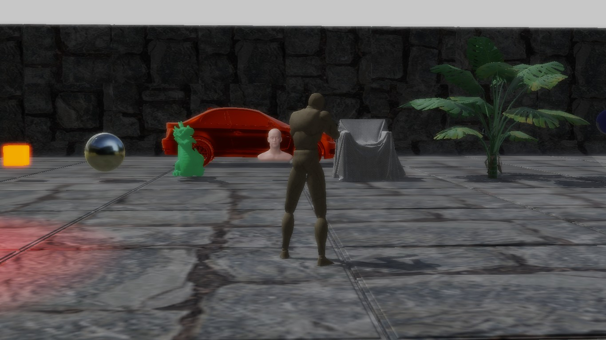

# REngine

## 总体目标：

1. 渲染引擎
2. 体量小，避免冗余繁杂的设计，体现引擎的功能框架
3. 针对新一代渲染api
4. 设计及实现上应该是清晰简单易懂的
5. 程序应该是健壮的
6. 体现新一代渲染api特性（多线程渲染，多显卡利用，PSO等）
7. 尽量使用标准库或准标准库boost
8. 能够满足未来新技术的快速测试需要
9. 渲染资源来源用UE4导出（houdini usd庞大暂不考虑）

## 设计

### 框架

划分mainthread和renderthread。mainthread负责主要引擎逻辑，renderthread负责渲染相关。

### 命名

### class命名规则

按照UE4引擎的规则，即mainthread的用U打头，renderthread的用F打头

### class成员变量

public用大写字母开头

protect和private用m开头，静态的用ms开头

成员排列按照逻辑层次从高到低排列，相同逻辑层次按照复杂程度从高到低排列，public成员变量排前，其次是protect和private

### class 方法

public用大写字母开头

protect用小写字母开头

private用下划线+小写字母写开头

## 目前进展

读取UE4导出的二进制staticmesh，目前仅有position,normal,texcoord信息，渲染basecolor贴图作为颜色输出。

独立出renderthread，封装rhi层，但很多方面需要完善。

截图

